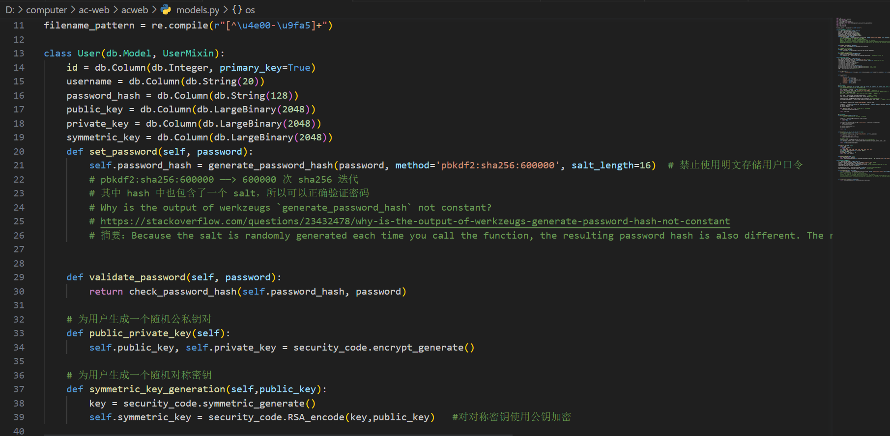

# 个人总结技术报告

## 个人贡献
   
本次密码学实践作业，我在组内主要主要负责任务是`基于网页的文件上传加密与数字签名系统`，以及设计了项目内的`加解密算法模块`并调用在已经设计好的框架内。

## 心路历程

我个人感觉项目内最大的麻烦还是分工问题，因为前后端的耦合度好高，按照李明萱同学设计框架，我们在框架中写功能的分工方式来做，一不小心就会分道扬镳

- 在项目开始的时候，我主要在以`crypto2`分支为基础框架设计`加解密算法模块`(security_code.py)，并把它调用到models.py中。

- 当时我们设计的框架其实比较模糊，我个人理解是在用户注册的时候，为每个用户分配`公私钥对`和`对称密钥`，对称密钥用来加密文件，对称密钥使用公钥加密，并在使用的时候用私钥解密，三把密钥同时存在数据库的`User表`中。加密的文件存在`CloudFile表`中

- 在`crypto2`分支完成`基于网页的文件上传加密与数字签名系统`之后，我们出现了分歧，李明萱同学设计的框架是想对服务端生成一对`公私钥对`之后分发给每一个用户，来解密不同文件的对称密钥。并将这个统一的公私钥对存在服务端上(admin_locker表中)，但我们觉得公私钥对只有一对并存在服务端上失去了非对称加密的意义，于是乎，我开始了对主分支的框架修正。
创建`crypto3`分支，公钥存储在user数据库内，私钥存在用户本地，以保证安全性。修改加解密算法的使用，从面向过程到面向对象。

## 遇到的难点与解决方案

这次作业我负责的部分没有太大的问题，都是一些小问题。主要遇到的难点是对已经成型的框架进行修改，有一种牵一发而动全身的感觉，不知道修改的参数会影响其中哪些文件出现问题。只能通过先修改框架，再对其他出现问题的文件一一修改，虽然感觉技术上难度不大，但是过程比较繁琐。
