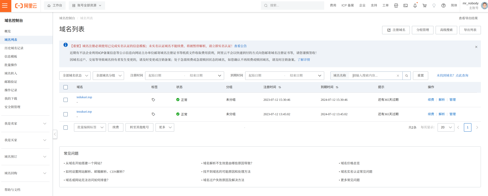
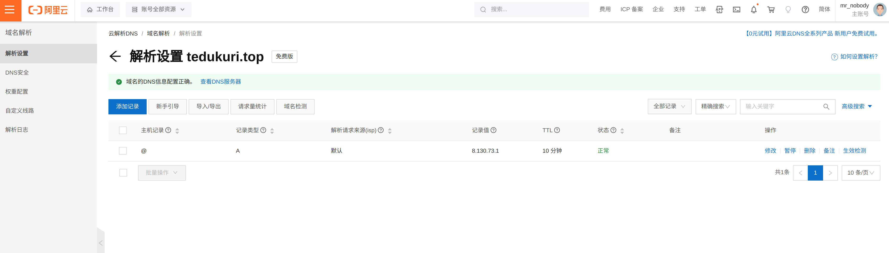
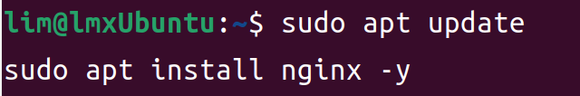
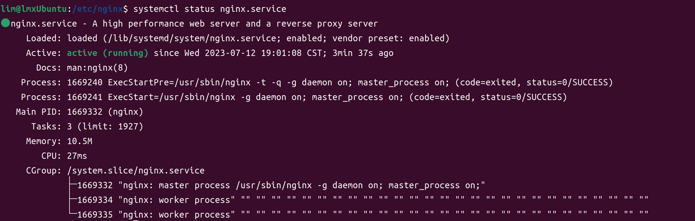
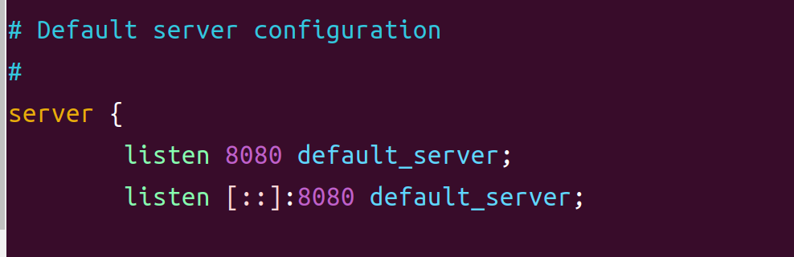
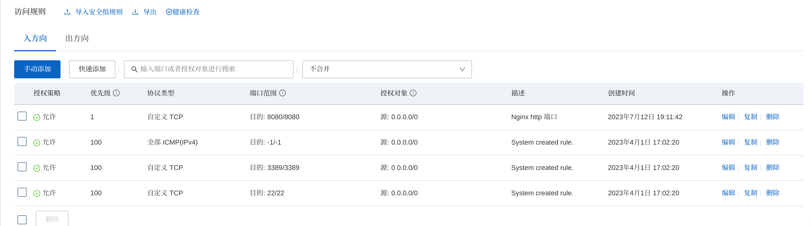
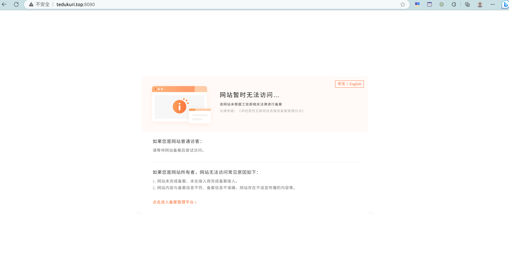
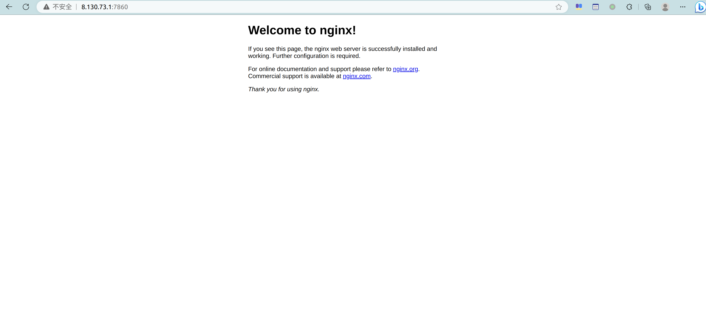
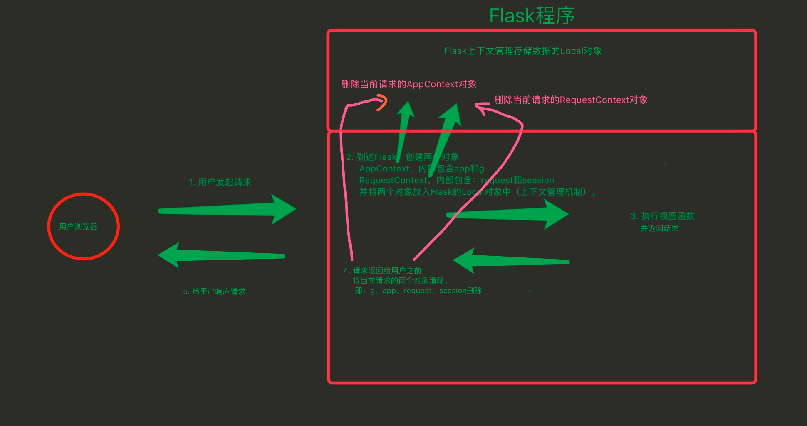
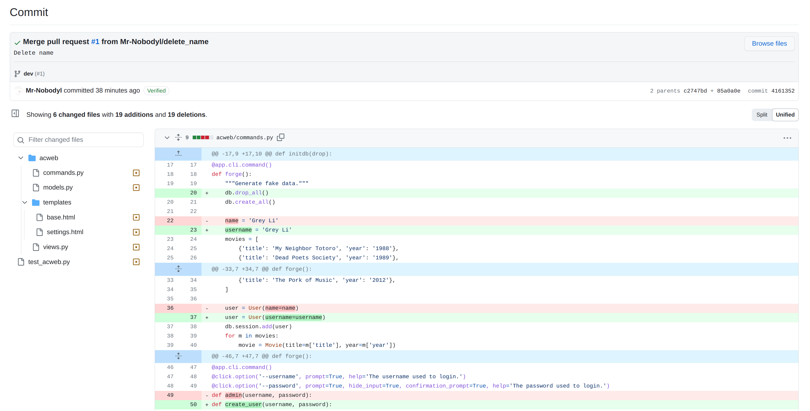

# NobodyI

> ~~首先是在还没有看视频和直播课要求的情况下，自己单从文字要求下想先利用 `Nginx` 作为反向代理，先建立 `HTTPS` 安全信道的一些瞎折腾记录~~

## 域名配置 & Nginx

购买了两个域名，分别为 `tezukuri.top` 和 `tedukuri.top`



配置云 DNS 解析：



稍等片刻（约半个小时），本地即可正常解析：

```bash
lim@LapN:/etc$ nslookup tedukuri.top
Server:         127.0.0.53
Address:        127.0.0.53#53

Non-authoritative answer:
Name:   tedukuri.top
Address: 8.130.73.1
```

### 关于域名的选择

~~`tedukuri.top` 为日语「手作り」的罗马音，意为「手工制作」，与本项目的初衷相符~~

更重要的是便宜，9 元一年，续费 29 元一年（可能是域名服务商将 `tedukuri` 当做没有意义的英文单词来定的价）

## Nginx

安装 Nginx：



```bash
sudo apt update
sudo apt install nginx
```

检查 Nginx 状态：




因为国内众所周知的原因，更改 Nginx 默认监听的 80 端口为 8080 端口：



验证：

```bash
lim@lmxUbuntu:/etc/nginx$ curl localhost:8080
```

修改阿里云安全组规则，允许 8080 端口的访问：



还是被劫持问候了：



但是 IP 还能访问：



备案估计要花 10 多天，还是想其他办法吧

## Flask 架构



---

> 下面是在看完视频和直播课要求后，重新完成时的一些记录

## `delete_name` 分支

原项目由于在 `User` 类下既有 `name` 又有 `username` 字段，造成了后续代码的一些混乱，所以新建了 `delete_name` 分支，将 `name` 字段从整个项目逻辑中删除，只保留 `username` 字段



## 参考

- [Quickstart Flask Documentation (2.3.x)](https://flask.palletsprojects.com/en/2.3.x/quickstart/)
- [Tutorial Flask Documentation (2.3.x)](https://flask.palletsprojects.com/en/2.3.x/tutorial/)
- [Dropzone.js](https://www.dropzone.dev/)
- [How To Install Nginx on Ubuntu 22.04](https://www.digitalocean.com/community/tutorials/how-to-install-nginx-on-ubuntu-22-04#server-logs)
- [Flask（9）- 蓝图的基本使用](https://www.cnblogs.com/poloyy/p/15004389.html)
- [Flask 入门教程](https://read.helloflask.com/)
- [How to use Flask-Session in Python Flask ?](https://www.geeksforgeeks.org/how-to-use-flask-session-in-python-flask/)
- [如何处理请求](https://dormousehole.readthedocs.io/en/latest/lifecycle.html#id5)(venvw)
- [Flask 文件上传（四）：文件管理与多文件上传](https://zhuanlan.zhihu.com/p/24429519)
- [Secret Key Encryption](https://pynacl.readthedocs.io/en/latest/secret/)
- [PyCryptodome’s documentation](https://www.pycryptodome.org/)