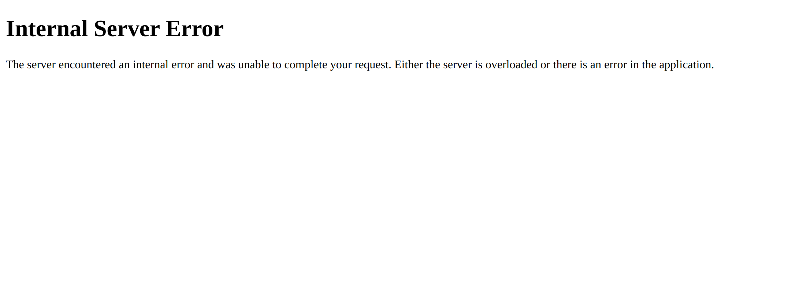

# NobodyI

> ~~首先是在还没有看视频和直播课要求的情况下，自己单从文字要求下想先利用 `Nginx` 作为反向代理，先建立 `HTTPS` 安全信道的一些瞎折腾记录~~

## 域名配置 & Nginx

购买了两个域名，分别为 `tezukuri.top` 和 `tedukuri.top`


配置云 DNS 解析：


稍等片刻（约半个小时），本地即可正常解析：

```bash
lim@LapN:/etc$ nslookup tedukuri.top
Server:         127.0.0.53
Address:        127.0.0.53#53

Non-authoritative answer:
Name:   tedukuri.top
Address: 8.130.73.1
```

### 关于域名的选择

~~`tedukuri.top` 为日语「手作り」的罗马音，意为「手工制作」，与本项目的初衷相符~~

更重要的是便宜，9 元一年，续费 29 元一年（可能是域名服务商将 `tedukuri` 当做没有意义的英文单词来定的价）

## Nginx

安装 Nginx：


```bash
sudo apt update
sudo apt install nginx
```

检查 Nginx 状态：


因为国内众所周知的原因，更改 Nginx 默认监听的 80 端口为 8080 端口：


验证：

```bash
lim@lmxUbuntu:/etc/nginx$ curl localhost:8080
```

修改阿里云安全组规则，允许 8080 端口的访问：


还是被劫持问候了：


但是 IP 还能访问：


备案估计要花 10 多天，还是想其他办法吧

## Flask 架构


---

> 下面是在看完视频和直播课要求后，重新完成时的一些记录

## [`delete_name` 分支](https://github.com/Mr-Nobodyl/ac-web/pull/1)

原项目由于在 `User` 类下既有 `name` 又有 `username` 字段，造成了后续代码的一些混乱，所以新建了 `delete_name` 分支，将 `name` 字段从整个项目逻辑中删除，只保留 `username` 字段


## [`update_pkg` 分支](https://github.com/Mr-Nobodyl/ac-web/pull/2)

由于原项目中的 `requirements.txt` 文件中的包版本过低，我担心其会造成一些安全问题，而且很可能过几年后这些包的版本会过时，所以我将其更新到了最新版本

当然在这其中也遇到了一些问题，比如 `Flask` 的版本更新到了最新后，需要强制使用 `app.context`，`flask-sqlalchemy` 也将 `Query` 归为了 `deprecating`，所以改为使用 `session.query` 来代替

## sqlite3 数据库

在后面遇到了一个小 bug：在服务器运行的过程中，如果运行 `test_acweb.py` 单元测试，再次访问页面将会出现 `Internal Server Error`



后面 `debug` 了一会才发现，在 `test_acweb.py` 的单元测试中，原本将 `sqlite3` 使用内存数据库，但是在更新包版本后，[这段代码](https://github.com/Mr-Nobodyl/ac-web/blob/7bcd0744d373d271c2bc5d56c95eea7865a50b3a/test_acweb.py#L13) 并没有成功更新 `SQLALCHEMY_DATABASE_URI`，从而导致在测试时使用的是原本文件系统中的 `sqlite3` 数据库，而不是内存数据库

虽然这个 `bug` 其实感觉也无伤大雅——只要在 web 程序运行时时不运行 `test_acweb.py` 单元测试就不会出现这个问题，但是还是感觉不爽想要解决一下

然后在修复时，尝试了几种办法都没有成功，最后参考了这篇 Stack Overflow 的 [回答](https://stackoverflow.com/questions/43466927/sqlalchemy-database-uri-not-set)，在 `__init__` 只是初始化 `SQLAlchemy`，在 `test_acweb.py` 中再进行 `SQLAlchemy` 实例与 `app` 的绑定

本以为已经解决了这个问题，但是发现在运行 `flask run` 时又出错了——>上面的解决方法将会导致 `SQLAlchemy` 实例与 `app` 的绑定在 `test_acweb.py` 中，而不是在 `__init__` 中，其他程序从 `acweb` 中导入 `db` 时将会导入没有与 `app` 绑定的 `db`

想了几种解决方案，最后，突然想到了程序设计模式中的 `工厂模式`，对！就是 `app_factory`！

参考 [Flask - Application Factories](https://flask.palletsprojects.com/en/2.3.x/patterns/appfactories/) 解决

这里研究了一段时间，但是如果要使用 `工厂模式` 对 `app` 进行初始化的话，整个项目的架构的很多地方都需要做相应的修改，所以最后还是放弃了使用 `工厂模式`，而是使用 `环境变量` 的一个小 `trick` 来解决了这个问题（但是我在想这个问题归根到底应该还是 `SQLAcademy 2.0` 的一个小 bug，没有像 1.0 版本中在 app.update 中成功更新 `SQLALCHEMY_DATABASE_URI`）

## 参考

- [Quickstart Flask Documentation (2.3.x)](https://flask.palletsprojects.com/en/2.3.x/quickstart/)
- [Tutorial Flask Documentation (2.3.x)](https://flask.palletsprojects.com/en/2.3.x/tutorial/)
- [Dropzone.js](https://www.dropzone.dev/)
- [How To Install Nginx on Ubuntu 22.04](https://www.digitalocean.com/community/tutorials/how-to-install-nginx-on-ubuntu-22-04#server-logs)
- [Flask（9）- 蓝图的基本使用](https://www.cnblogs.com/poloyy/p/15004389.html)
- [Flask 入门教程](https://read.helloflask.com/)
- [How to use Flask-Session in Python Flask ?](https://www.geeksforgeeks.org/how-to-use-flask-session-in-python-flask/)
- [如何处理请求](https://dormousehole.readthedocs.io/en/latest/lifecycle.html#id5)(venvw)
- [Flask 文件上传（四）：文件管理与多文件上传](https://zhuanlan.zhihu.com/p/24429519)
- [Secret Key Encryption](https://pynacl.readthedocs.io/en/latest/secret/)
- [PyCryptodome’s documentation](https://www.pycryptodome.org/)
- [flask-drop](https://flask-dropzone.readthedocs.io/en/latest/basic.html)
- [正确理解Python中的 @staticmethod@classmethod方法](https://zhuanlan.zhihu.com/p/28010894)
- [Flask - Application Factories](https://flask.palletsprojects.com/en/2.3.x/patterns/appfactories/)
- [Flask 配置](https://spacewander.github.io/explore-flask-zh/5-configuration.html)
- [How TO - Register Form](https://www.w3schools.com/howto/howto_css_register_form.asp)